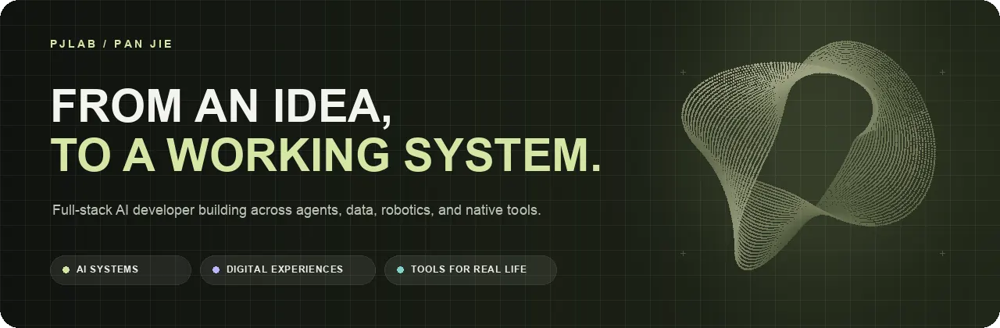

  <picture>
    <source media="(prefers-reduced-motion: reduce)" srcset="https://raw.githubusercontent.com/pj-workspace/pj-workspace/main/assets/pjlab-profile-header-static.webp" />
    
  </picture>

  
  
  
  
  

> I build at the intersection of **AI, data, and product engineering**—turning specific problems into systems people can actually use.

<table>
  <tr>
    <td width="48%" valign="top">
      
    </td>
    <td width="52%" valign="top">
      
<strong>CONTRIBUTION SIGNAL / PJLAB TRACE</strong>

      <picture>
        <source media="(prefers-color-scheme: dark)" srcset="https://raw.githubusercontent.com/pj-workspace/pj-workspace/output/pjlab-trace-dark.svg" />
        <source media="(prefers-color-scheme: light)" srcset="https://raw.githubusercontent.com/pj-workspace/pj-workspace/output/pjlab-trace-light.svg" />
        
      </picture>
    </td>
  </tr>
</table>

  

