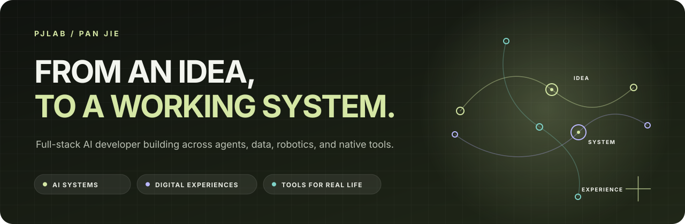

  

  
  
  

> I build at the intersection of **AI, data, and product engineering**—turning specific problems into systems people can actually use.

## About

I’m **Pan Jie (Jay)**, a software engineering undergraduate and full-stack AI developer. My work spans agent workspaces, multimodal data systems, robotics operations, and native macOS tools.

What connects these projects is a bias toward complete systems: the interface, service, data model, and operational feedback should make sense together—not only in a demo, but throughout the real workflow.

- **Now:** building agent workspaces, multimodal data tools, and robotics data infrastructure
- **Practice:** full-stack product development, context engineering, interaction design, and system integration
- **Next:** refining the systems already in motion and preparing for graduate study in artificial intelligence in 2027

## Selected systems

<table>
  <tr>
    <td width="50%" valign="top">
      <h3>Alcuin</h3>
      
AGENT WORKSPACE · PRE-ALPHA

      
A workspace for long-running agent conversations where context, knowledge, tools, traces, and approvals remain inspectable.

      
<code>Next.js</code> <code>FastAPI</code> <code>LangGraph</code> <code>MCP</code> <code>Qdrant</code>

      
<a href="https://github.com/pj-workspace/alcuin">View repository ↗</a>

    </td>
    <td width="50%" valign="top">
      <h3>Multimodal Data Platform</h3>
      
PROFESSIONAL WORK · LIVE / EVOLVING

      
A collaborative annotation and review platform spanning images, audio, video, text, and point clouds. I hold sole development responsibility across import, workspace, review, and delivery flows.

      
<code>Vue 3</code> <code>TypeScript</code> <code>Spring Boot</code> <code>Point Clouds</code>

      
<a href="https://pjlab.top/en#work">Read the overview ↗</a>

    </td>
  </tr>
  <tr>
    <td width="50%" valign="top">
      <h3>OpenRoboOps</h3>
      
ROBOTICS DATA OPERATIONS · OPEN SOURCE V0.1

      
One console for robot telemetry, camera previews, collection tasks, and datasets—with resumable transfers, integrity checks, and safety-conscious device adapters.

      
<code>Next.js</code> <code>FastAPI</code> <code>PostgreSQL</code> <code>AsyncSSH</code> <code>WebSocket</code>

      
<a href="https://github.com/pj-workspace/openroboops">View repository ↗</a>

    </td>
    <td width="50%" valign="top">
      <h3>FlowShelf</h3>
      
NATIVE MACOS UTILITY · OPEN SOURCE V0.1

      
A lightweight floating shelf for moving files between apps while preserving Finder semantics, source locations, Quick Look, and the rhythm of the current task.

      
<code>Swift 6</code> <code>AppKit</code> <code>SwiftUI</code> <code>Quick Look</code>

      
<a href="https://github.com/pj-workspace/FlowShelf">View repository ↗</a>

    </td>
  </tr>
</table>

## Engineering stance

**01 · Make context traceable.**  
Compression should retain a path back to its sources; tool execution should remain understandable after the page reconnects.

**02 · Let interface certainty match system reality.**  
An interaction looking complete is not the same as its data being saved, reviewed, and ready to move forward.

**03 · Respect the system around the tool.**  
The best small utilities fit existing workflows and platform semantics instead of asking users to relearn them.

## Working set

| Area | Tools and technologies |
| --- | --- |
| **Languages** | TypeScript · Python · Java · Swift |
| **Product surfaces** | React · Next.js · Vue 3 · SwiftUI · AppKit |
| **Services & data** | FastAPI · Spring Boot · PostgreSQL · Qdrant · WebSocket |
| **AI systems** | LangGraph · Spring AI · RAG · MCP · OpenAPI |
| **Delivery** | Docker · GitHub Actions · Nginx · Linux |

## More explorations

- **[DID SAT](https://didsat.pjlab.top)** — decentralized identity resolution and TLS security assessment
- **[TCM Knowledge Agent](https://github.com/pj-workspace/tcm-intelligent-inquiry)** — domain inquiry with retrieval and structured knowledge
- **ZhiXing** — AI-assisted travel planning with Spring AI
- **Video Data Analysis** — data collection, text analysis, and visual exploration

---

  <strong>An idea worth building together?</strong> 
  AI products · open-source projects · problems that are still taking shape  
  <a href="https://pjlab.top/en">pjlab.top</a> ·
  <a href="mailto:Suzuya12138@gmail.com">email</a> ·
  <a href="https://gitee.com/Sunflower_PJ">gitee</a>

